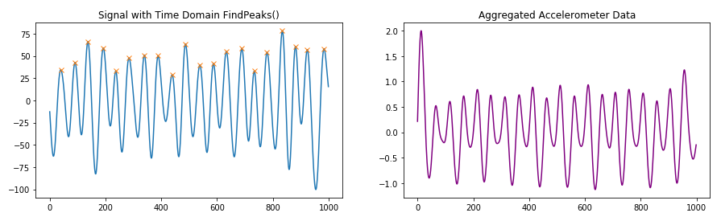

# Motion Compensated Pulse Rate Estimation

**Summary**

This repository includes two python notebooks:
- *pulse_rate.ipynb*: Python code for analyzing wrist-worn PPG signal data and estimating a pulse rate while including data from a three-axis accelerometer. The algorithm is design to detect the correct pulse rate in the presence of severe movement artifacts.
- *clinical_application*.ipynb: Heart rate trend investigation using CAST dataset.

Project completed as part of Udacity AI for Healthcare course (2020).

**Code Description**

The Python code may be used in two ways:

1) Analyze algorithm performance on [TROIKA](https://ieeexplore.ieee.org/document/6905737) dataset.

The function *RunPulseRateAlgorithm()* expects two files as input:
- data_fl: .mat file containing PPG and X, Y, Z accelerometer data from Troika dataset (or in Troika format)
- ref_fl: .mat file containing ground truth heart rates from Troika dataset (or in Troika format)
       
RunPulseRateAlgorithm() will compute the heart rate and confidence estimates for 8 second windows of the PPG and accelerometer data, and calculate the error (difference) between the heart estimates and the ground truth heart rate for each 8 second window provided in the reference file.

The function *Evaluate()* will calculate an overall mean absolute error at 90% availability (see Algorithm Performance section below), assuming the Troika data is located at *./datasets/troika/training_data*.

2) Predict heart rate from new input PPG and Accelerometer data.

The function *AnalyzeWindow()* accepts numpy arrays of ppg, and accelerometer data in the x, y, and z axis, along with a sampling rate. A precondition of the function is that the incoming ppg and acceleromter data was sampled at the provided sampling rate and is aligned in time. While the algorithm was only tested with 8 second windows of PPG and accelerometer data and a sampling rate of 125 Hz, the AnalyzeWindow function may be applied to a longer window sizes or alternate sampling rates. AnalyzeWindow() returns a tuple of (BPM prediction, confidence) for the provided window of ppg and accelerometer data using the provided sample rate.

**Data Description**

The data used to design and test this algorithm was taken from the [TROIKA](https://ieeexplore.ieee.org/document/6905737) dataset. The dataset includes 12 subjects ages 18 to 35 with simultaneously recorded two-channel wrist-mounted PPG signals, wrist-mounted three-axis accelerometer signals, and one-channel chest-mounted ECG. The subjects ran on a treadmill at increasing rates to range from resting heart rate to intense exercise heart rate. To build a more complete dataset, it would be beneficial to include a greater number of participants that represent the broader population demographics for age and gender. Additionally, it would be useful to record PPG and accelerometer data from more points on the body that could be used in future wearable devices such as the feet, legs, upper arms, and head. This could provide a more complete picture of how accelerometer signals affect PPG data across the body. Alternative exercises could be recorded as well, such as cylcing, swimming, tennis, and weight lifting, each of which may produce different physiological responses or signal patterns.

**Algorithm Description**

The heart rate prediction algorithm takes advantage of the physiology of blood flow through the ventricles of the wrist. Light emitted by an LED on the PPG sensor is reflected less when the ventricles contract and more blood is present, and light is reflected more when the blood returns to the heart and fewer red blood cells are present. Arm movement will also affect the blood levels in the wrist, so periodic motion such as an arm swinging back and forth can also be detected by the PPG signal. 

The algorithm identifies the strongest frequency components of both the PPG signal and the accelerometer signals to determine which frequency to pick as the heart rate. The algorithm follows these stages:

1) Apply bandpass filter to PPG and accelerometer signals to filter out frequencies outside of the 40-240 BPM range.

2) Aggregate the X, Y, and Z channels of the accelerometer signal into a signal magnitude signal

2) Tranform the time domain PPG and accelerometer signal to magnitude frequency representations by taking the absolute value of their Fast Fourier Transforms.

3) Using the frequency representations of PPG and accelerometer signals, find the peaks with the largest magnitudes, and choose one to be the predicted heart rate frequency.

- If the highest magnitude peak of both signals is different, choose the highest magnitude peak of the the PPG signal as the heart rate frequency prediction.
- If the highest magnitude peak of both signals is the same, this may mean that the arm swing signal is overpowering the pulse rate, so choose the next highest magnitude peak of the PPG signal as the heart rate frequency prediction.
- If each of the highest magnitude peaks of the PPG signal are too close to the peaks of the accelerometer signal, the arm swing frequency could be the same as the pulse rate frequency, so use the highest magnitude peak of the PPG as the heart rate frequency prediction, even though the accelerometer signal has the same peak).

4) Convert the chosen peak frequency to a final **BPM Prediction**, and calculate a **Confidence Value** for the chosen frequency by computing the ratio of energy concentrated near that frequency compared to the full signal.

The BPM Prediction and Confidence Value outputs from this algorithm are not gauranteed to be correct. Confidence values are only used to determine which outputs are very poor, i.e. a low confidence value implies very low signal to noise ratio, since only a small amount of energy is concentrated by the predicted peak. High confidence values do not necessarily imply the that algorithm is significantly more correct, only that the peak at that location is responsible for much more of the signal. Common failure modes include when accelerometer data has random movement spikes or when the three channels combine into a non-periodic signal.

**Algorithm Performance**

The algorithm performance was evaluated against the TROIKA reference data. All PPG data was compared against ECG "ground truth" BPM for associated time windows. ECG measures electric potentials across the heart and is considered to be a much more reliable method for obtaining pulse rate than PPG since these electrical signals are not susceptible to the same levels of movement-related noise. Using the confidence estimates to compare prediction quality, the bottom 10% of predictions were discarded while the remaining predictions were evaluated against the ground truth. The final calculated performance metric for the dataset at 90% availability was a mean absolute error (**MAE**) of **13.625 BPM**. This performance may be verified by executing the *Evaluate()* function.

This algorithm may not perform as well at >90% availability, and does not gaurantee that consecutive or overlapping time windows have similar confidence values, so it is possible that prediction confidence could vary greatly over time if this algorithm was applied to a real-time heart rate analysis scenario. This algorithm also assumes that accelerometer motion will largely result from swinging arms during running on a treadmill and will therefore be consistently periodic. This may not be the case for other activities, such as tennis or basketball.
